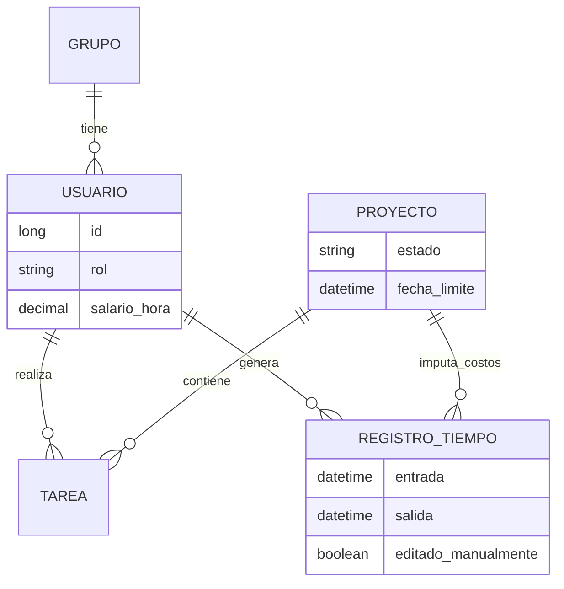

# 🚀 Sistema de Gestión de Proyectos, Tareas y Nómina

Documentación técnica y funcional para el sistema de seguimiento de proyectos con control de tiempo y cálculo de costos salariales.

---

## 1. 👥 Roles y Permisos

El sistema cuenta con tres niveles de acceso, cada uno con responsabilidades específicas:

### **👑 Director (Admin)**
* **Gestión Total:** Crea, edita y elimina Proyectos y Grupos.
* **Finanzas:** Define el **Salario por Hora** de cada empleado.
* **Dashboard Financiero:** Visualiza costos totales del proyecto (Dinero vs. Tiempo) y cuánto pagar a fin de mes.
* **Asignación:** Asigna empleados a proyectos.

### **👁️ Supervisor (Manager)**
* **Gestión Operativa:** Puede cambiar las **Horas Activas** de los empleados (Edición de registros de tiempo en casos de emergencia, ej: corte de luz/internet).
* **Visibilidad:** Ve los salarios (solo lectura) y el estado de todos los proyectos.
* **Estadísticas de Grupo:** Monitorea la eficiencia de los departamentos (Marketing, Finanzas, etc.).

### **👷 Empleado (User)**
* **Operación:** Marca inicio y fin de jornada (Check-in/Check-out) por proyecto.
* **Tareas:** Visualiza tareas asignadas y actualiza su estado (Pendiente -> Completado).
* **Auto-Gestión:** Ve sus propias estadísticas (tiempo invertido y tareas completadas).

---

## 2. 🗄️ Arquitectura de Datos (Entidades)

Diseño de la base de datos relacional para soportar la lógica de negocio.

### **A. Usuario**
Representa a todos los actores del sistema.

| Campo | Tipo | Descripción |
| :--- | :--- | :--- |
| `id` | `Long (PK)` | Identificador único. |
| `nombres` | `String` | Nombre completo. |
| `email` | `String` | Correo (Login). |
| `password` | `String` | Contraseña encriptada. |
| `rol` | `Enum` | `DIRECTOR`, `SUPERVISOR`, `EMPLEADO`. |
| `salario_hora` | `Decimal` | Costo por hora del empleado (Privado). |
| `grupo_id` | `Long (FK)` | Pertencia a Marketing, Dev, etc. |

### **B. Proyecto**
El contenedor principal del trabajo.

| Campo | Tipo | Descripción |
| :--- | :--- | :--- |
| `id` | `Long (PK)` | Identificador único. |
| `nombre` | `String` | Título del proyecto. |
| `descripcion` | `String` | Detalles generales. |
| `estado` | `Enum` | `EN_PRODUCCION`, `COMPLETADO`, `SUSPENDIDO`. |
| `fecha_limite` | `DateTime` | Deadline del proyecto. |

### **C. Tarea**
Unidad de trabajo dentro de un proyecto.

| Campo | Tipo | Descripción |
| :--- | :--- | :--- |
| `id` | `Long (PK)` | Identificador único. |
| `proyecto_id` | `Long (FK)` | Proyecto al que pertenece. |
| `nombre` | `String` | Título de la tarea. |
| `estado` | `Enum` | `PENDIENTE`, `COMPLETADO`, `SUSPENDIDO`. |
| `asignado_a` | `Usuario (FK)` | Empleado responsable. |
| `creado_por` | `Usuario (FK)` | Director o Supervisor que la creó. |

### **D. RegistroTiempo (TimeLog)**
**Entidad Clave:** Reemplaza el campo estático "TiempoEnProyecto" por un historial detallado.

| Campo | Tipo | Descripción |
| :--- | :--- | :--- |
| `id` | `Long (PK)` | Identificador único. |
| `usuario_id` | `Long (FK)` | Quién trabajó. |
| `proyecto_id` | `Long (FK)` | En qué trabajó. |
| `entrada` | `DateTime` | Hora de inicio. |
| `salida` | `DateTime` | Hora de fin (Puede ser NULL si está activo). |
| `horas_calc` | `Float` | Diferencia calculada (Salida - Entrada). |
| `editado_por` | `Usuario (FK)` | Si un supervisor modificó la hora manualmente. |

### **E. Grupo**
Agrupación lógica de empleados.

| Campo | Tipo | Descripción |
| :--- | :--- | :--- |
| `id` | `Long (PK)` | Identificador único. |
| `nombre` | `String` | Ej: "Desarrollo", "Marketing". |

---

## 3. 📊 Lógica de Negocio y Fórmulas

### **Cálculo de Nómina por Proyecto**
Para que el Director sepa cuánto dinero cuesta un proyecto basado en el tiempo invertido:

$$CostoProyecto = \sum_{i=1}^{n} (HorasTrabajadas_i \times SalarioHora_i)$$

> *Donde $i$ es cada registro de tiempo asociado a ese proyecto.*

### **Promedio de Productividad por Grupo**
Para determinar la carga laboral de un departamento (Ej. Finanzas):

$$PromedioGrupo = \frac{\sum HorasTotalesDeMiembros}{NumeroDeMiembros}$$

---

## 4. 🔄 Flujos de Uso Críticos

### **Caso: Corte de Luz / Internet (Supervisor)**
1.  El empleado no puede marcar su "Salida" porque no hay internet.
2.  El **Supervisor** inicia sesión.
3.  Accede a la lista de **"Sesiones Activas"**.
4.  Localiza al empleado y edita el campo `Salida` manualmente.
5.  El sistema guarda un log indicando que fue una edición administrativa.

### **Caso: Director Evaluando Costos**
1.  El **Director** entra al detalle de un Proyecto.
2.  El sistema suma todas las horas de la tabla `RegistroTiempo` vinculadas a ese proyecto.
3.  Multiplica cada hora por el `SalarioHora` del usuario específico.
4.  Muestra una alerta si el costo actual supera el presupuesto estimado.

---

## 5. 🗺️ Diagrama Entidad-Relación (Mermaid)

