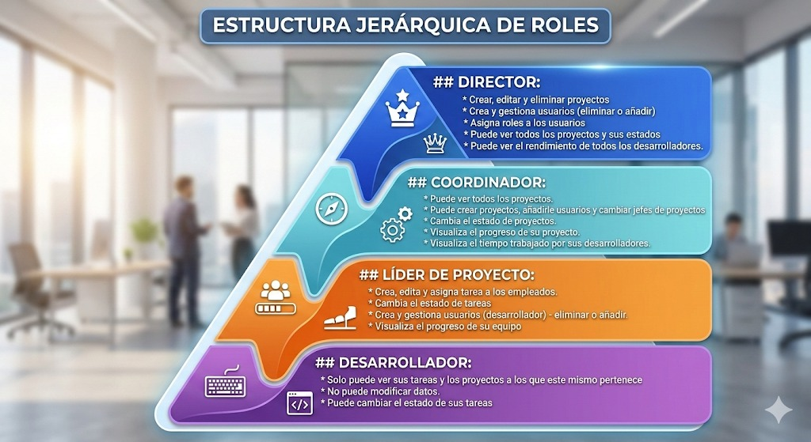

# Funciones de lo que hará cada Rol
## Director:
* Crear, editar y eliminar proyectos
* Crea y gestiona usuarios (eliminar o añadir)
* Asigna roles a los usuarios
* Puede ver todos los proyectos y sus estados
* Puede ver el rendimiento de todos los desarrolladores.

## Coordinador:
* Puede ver todos los proyectos y su información.
* Puede crear proyectos, añadirle usuarios y asignar lider de proyectos o cambiar los existentes.
* Cambia el estado de proyectos.
* Visualiza las tareas y tiempos de los desarrolladores.

## Líder de proyecto:
* Crea, edita y asigna tarea a los empleados.
* Crea y gestiona usuarios (desarrollador) - eliminar o añadir.
* Visualiza el progreso de su equipo
* Visualiza el tiempo trabajado por sus desarrolladores.

## Desarrollador:
* Solo puede ver sus tareas y los proyectos a los que este mismo pertenece
* No puede modificar datos.
* Puede cambiar el estado de sus tareas
* Consultar información sobre su proyecto

 